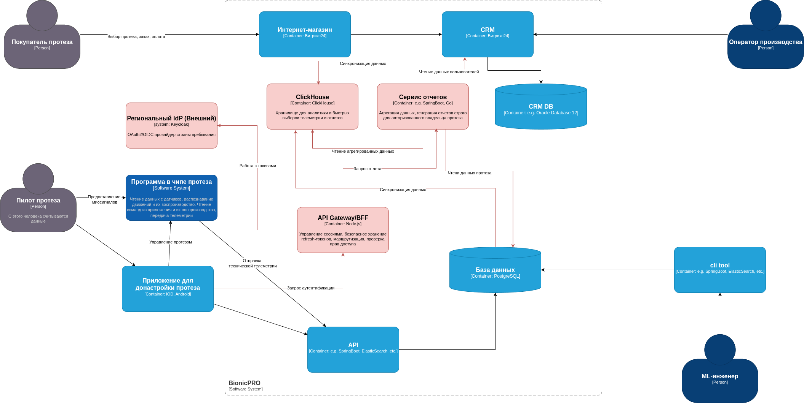
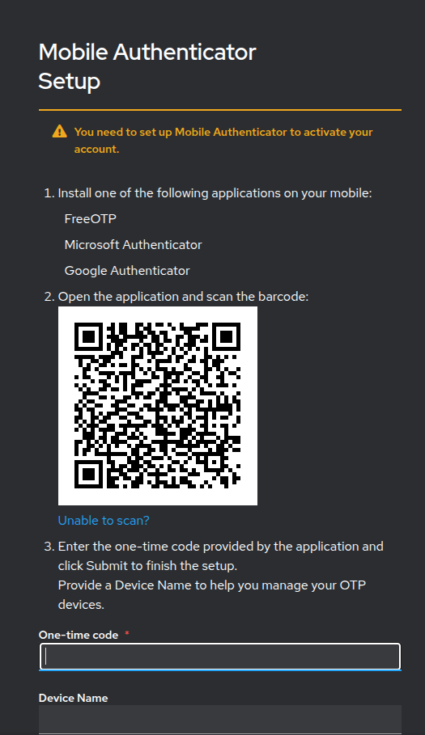
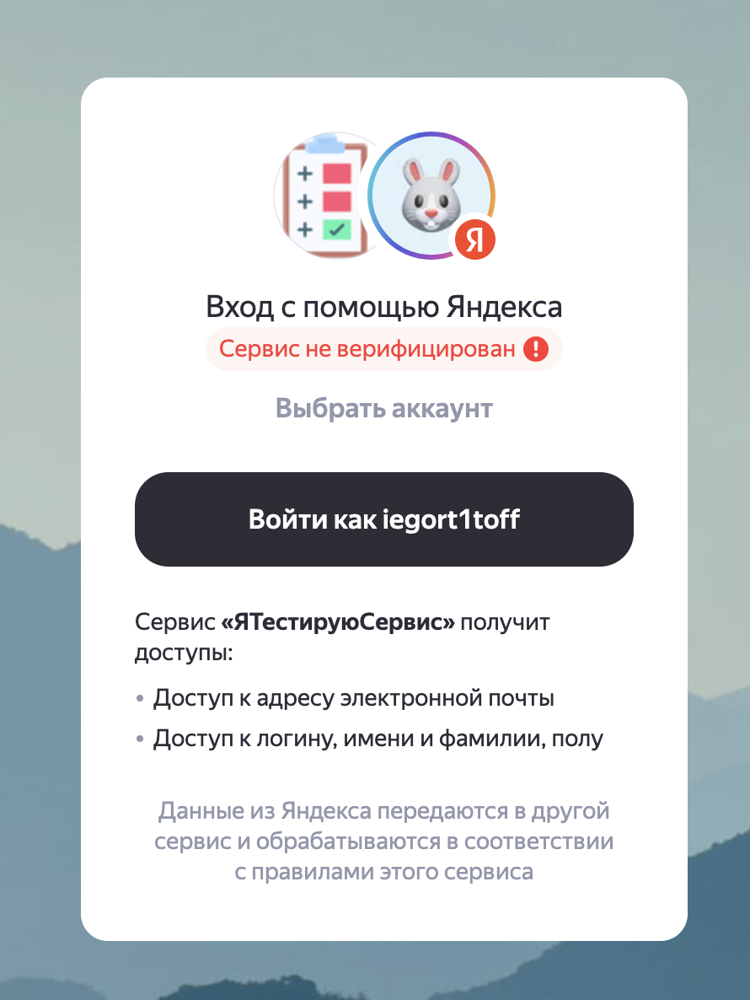
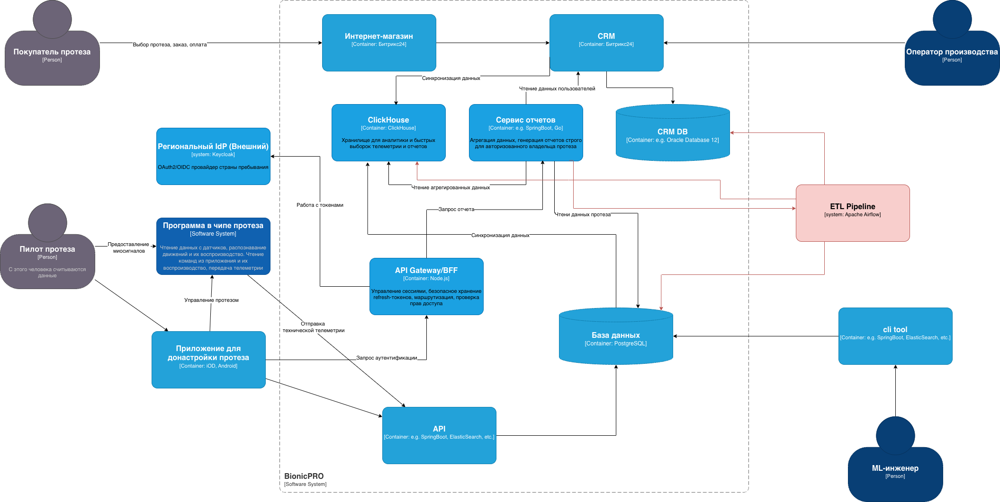

# Задание 1

## Задача 1

### Архитектурное решение

**1. Безопасная работа с токенами (Паттерн Backend-for-Frontend / BFF)**
Чтобы исключить передачу токенов, полученных от внешнего IdP (Identity Provider), на фронтенд (что защищает от XSS-атак и утечек через перехват токенов), внедряется компонент **API Gateway / BFF**. 
* Мобильное приложение взаимодействует только с BFF.
* BFF самостоятельно выполняет OAuth2/OIDC flow (Code Grant) с внешним IdP.
* BFF получает `access_token` и `refresh_token` от IdP и хранит их безопасно на своей стороне (в зашифрованном виде в базе данных сессий или в защищенном хранилище).
* Фронтенду выдается короткий, непрозрачный session-токен (или устанавливается Secure HTTP-Only Cookie), который не имеет ценности вне контекста данной сессии BFF.

**2. Поддержка региональных IdP и локализация данных**
Для соблюдения законодательства разных стран (например, 152-ФЗ в РФ, GDPR в ЕС) внедряется **Федерация идентификации**:
* BFF определяет регион пользователя (по домену, IP или явному выбору при регистрации).
* Аутентификация перенаправляется на соответствующий региональный IdP (например, Keycloak в дата-центре РФ для российских пользователей, другой провайдер для ЕС).
* Персональные и медицинские данные (PII) хранятся в региональных инстансах баз данных (PostgreSQL), физически расположенных в стране представительства, что гарантирует соблюдение принципов локального хранения.

**3. Безопасная генерация отчетов и работа с большими данными**
Для решения проблемы производительности PostgreSQL и задачи по выгрузке отчетов:
* Внедряется **Сервис отчетов (Reporting Service)**.
* Данные из основной PostgreSQL и CRM асинхронно реплицируются (например, через CDC — Change Data Capture, Debezium) в аналитическую колоночную базу данных **ClickHouse**. ClickHouse идеально подходит для быстрых выборок и агрегации больших объемов телеметрии.
* **Строгая изоляция данных**: Сервис отчетов реализует проверку прав на уровне приложения (или Row-Level Security в ClickHouse). При запросе отчета BFF передает внутренний идентификатор пользователя. Сервис отчетов формирует запрос к ClickHouse *строго* с фильтром по `user_id` или `prosthesis_id`, гарантируя, что пользователь физически не может получить данные другого человека.

### Исправленная диаграмма

.drawio файл находится [тут](./task-1/C4.drawio)



## Задача 2
Принудительно включаем PKCE в сервисе keycloak. В файле `realm-export.json` указываем
```json
"clientId": "reports-frontend",
"enabled": true,
"publicClient": true,
"standardFlowEnabled": true,
"redirectUris": ["http://localhost:3000/*"],
"webOrigins": ["http://localhost:3000"],
"directAccessGrantsEnabled": true,
"attributes": {
    "pkce.code.challenge.method": "S256"
}
```
и во фронтенде изменения в файле `App.tsx`
```js
const initOptions: KeycloakInitOptions = {
  onLoad: 'check-sso', 
  pkceMethod: 'S256',
};
```

## Задача 3

Я написал (попытался во всяком случае) код на python. Собрав в docker и закинул в docker-compose.

Что сделано крупными мазками:

- **Добавлен новый сервис аутентификации** в `docker-compose.yaml` – `bionicpro-auth`, который принимает запросы на логин/логаут и управление сессиями, а также проксирует аутентификацию к Keycloak.
- **Изменена архитектура авторизации на фронтенде**: вместо библиотеки `@react-keycloak/web` теперь используется собственная форма входа. Фронтенд отправляет запросы на `bionicpro-auth` (через nginx proxy), который проверяет учётные данные и управляет сессионными куками.
- **Полностью переработан компонент `ReportPage`**: добавлена логика проверки аутентификации, форма входа с полями username/password, отображение списка отчётов, возможность их загрузки и выхода из системы.
- **Настроен nginx** для проксирования запросов к `/api/auth/` на новый сервис аутентификации.
- **Обновлена конфигурация Keycloak** (файл `realm-export.json`): добавлены параметры времени жизни токенов и сессий (access token 120 сек, SSO idle timeout 600 сек и т.д.), что позволяет более гибко управлять сессиями через `bionicpro-auth`.
- **Улучшена оркестрация в Docker Compose**: добавлен healthcheck для базы данных Keycloak, настроены явные зависимости между сервисами (Keycloak ждёт здоровую БД, фронтенд ждёт `bionicpro-auth`), а также добавлены переменные окружения для URL аутентификационного сервиса.

## Задача 4

Основные изменения:

- **Добавлены два новых сервиса в Docker Compose**:
  - `openldap` – LDAP-сервер, собранный из локального `Dockerfile`, с volumes для хранения данных и конфигурации, healthcheck и открытыми портами 389 (LDAP) и 636 (LDAPS).
  - `phpldapadmin` – веб-интерфейс для управления LDAP, доступный на порту 6443. Он зависит от здорового состояния openldap.

- **Расширена конфигурация Keycloak (`realm-export.json`)**:
  - Добавлен провайдер федерации пользователей (`userFederationProviders`) для подключения к OpenLDAP: указаны URL, DN привязки, базовый DN для пользователей (`ou=People,dc=example,dc=com`) и групп (`ou=Groups,dc=example,dc=com`), режим `READ_ONLY`.
  - Добавлены мапперы (компоненты), которые сопоставляют атрибуты LDAP с полями пользователя Keycloak: `email` → `mail`, `firstName` → `cn`, `lastName` → `sn`.
  - Добавлен маппер ролей, который связывает LDAP-группы (например, `cn=prothetic_user`) с ролями Keycloak, работая в режиме только для чтения.

- **Доработана начальная LDAP-структура (`config.ldif`)**:
  - Добавлена корневая запись домена `dc=example,dc=com`.
  - Исправлено имя пользователя `alex.johnson` (было просто `alex`).


## Задача 5
Добавлен OTP



## Задача 6

Добавлен Yandex OAuth




# Задание 2

## Задача 1

### Архитектурное решение

1. **Источники данных (Sources):** 
   - Основная **PostgreSQL** (телеметрия, статусы батареи, миосигналы).
   - **CRM DB** (Oracle/Битрикс24) (данные пользователя, модель протеза, дата установки).
2. **Оркестрация ETL (Apache Airflow):** 
   - Airflow управляет DAG-ами, которые по расписанию (например, раз в час или раз в сутки) запускают процессы извлечения данных.
3. **Трансформация и Загрузка (Transform & Load):** 
   - Данные извлекаются, очищаются и объединяются (JOIN) по ключу `prosthesis_id` / `user_id`. 
   - Результирующие агрегированные данные загружаются в **OLAP-базу данных ClickHouse**. ClickHouse идеально подходит для хранения временных рядов (телеметрии) и мгновенной агрегации больших объемов данных.
4. **Сервис отчетов (Reporting API):** 
   - Отдельный микросервис, который предоставляет endpoint для получения отчета.
   - **Критически важно:** Сервис получает идентификатор пользователя из BFF (сервиса аутентификации) и формирует запрос к ClickHouse **строго с фильтром** `WHERE user_id = {current_user_id}`. Это гарантирует, что пользователь увидит только свои данные.


.drawio файл находится [тут](./task-2/C4.drawio)



## Задача 2

Развёрнута система, состоящая из:
- ETL-процесса (Airflow) – ежедневная загрузка данных клиентов и телеметрии, построение витрины `report_mart`.
- Backend API (FastAPI) – предоставление отчётов авторизованным пользователям.
- UI (React) – кнопка для генерации отчёта и выбора периода.
- OLAP-хранилища (ClickHouse) – итоговая витрина данных.
- Сервиса авторизации (`bionicpro-auth`) – проверка сессий и извлечение `customer_id`.

Все компоненты объединены в `docker-compose.yaml`.